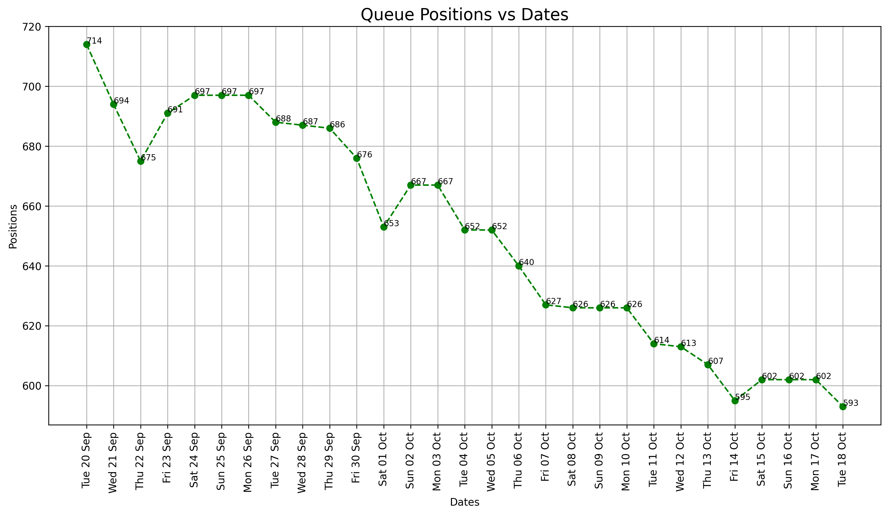

# EnterFinland-application-queue-position-tracker

This simple script logs position value from EnterFinland api and also plots data for visualization. Script takes only one argument and that is diary number of an application.

Note: `The script can be set up to run periodically to collect data after a set interval. I would suggest setting the interval to 5-30 mins.`

An example of visualization from logged data.

